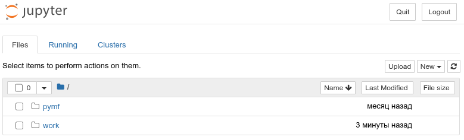
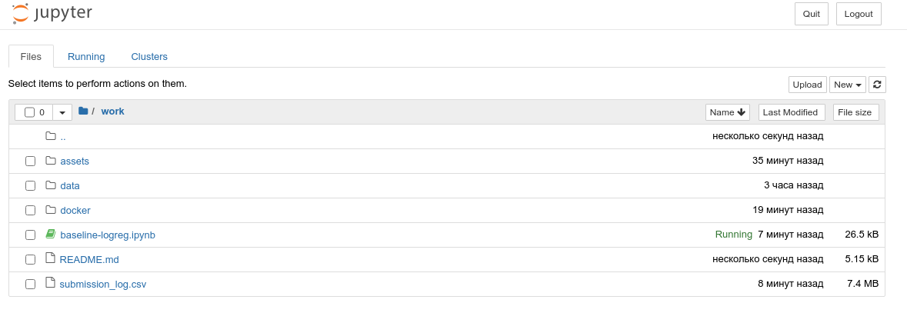

# Проект №4. Рекомендательные системы

## Задача

https://www.kaggle.com/c/recommendationsv4/overview

## Участие в совместной работе

Для участия в совместной работе надо:

- [зарегистрироваться на GitHub](https://github.com/join)
- [установить и настроить Git](https://docs.github.com/en/github/getting-started-with-github/set-up-git): см. раздел "Setting up Git"
- [установить Git LFS](https://www.git-tower.com/learn/git/ebook/en/command-line/advanced-topics/git-lfs): см. раздел "Installing Git LFS". Внимание! После установки Git LFS надо обязательно выполнить в терминале команду `git lfs install`
- отправить в Slack сообщение [yury bikuzin](https://sfdatasciencecourse.slack.com/team/U016P0Y3CP7) с запросом на yчастие в совместной работе, в запросе необходимо указать свой логин на GitHub

- развернуть локальный репозиторий: 

через https:

```
git clone https://github.com/yurybikuzin/skillfactory_rds4_recommendation_challenge.git
```

или через ssh, если Вы [настроили доступ через SSH](https://docs.github.com/en/github/authenticating-to-github/connecting-to-github-with-ssh), что позволяет не вводить свои логин и пароль при каждой отправке изменений в локальном репозитории на сервер:

```
git clone git@github.com:yurybikuzin/skillfactory_rds4_recommendation_challenge.git
```

## Структура репозитория

В папке [data](data) находятся zip-файлы из https://www.kaggle.com/c/recommendationsv4/data

В корневой папке находятся все ноутбуки:

- [baseline-logreg.ipynb](baseline-logreg.ipynb) - адаптированный ноутбук https://www.kaggle.com/dmitriykrylov/baseline-logreg с https://www.kaggle.com/c/recommendationsv4/notebooks. Этот ноутбук, предварительно скопировав, можно взять за основу своего ноутбука

## Запуск Jupyter-ноутбука в docker-контейнере

После [установки Docker](https://docs.docker.com/engine/install/) (и выполнения, в случае Linux, [Post-installation steps for Linux](https://docs.docker.com/engine/install/linux-postinstall/)) надо в терминале перейти в корневую папку репозитория и выполнить команду:

В Windows Command Line (`cmd`):

```
docker run -p 8888:8888 -v %cd%:/home/jovyan/work bazawinner/dev-recommend-proj:2
```

В Windows Power Shell, macOS, linux:

```
docker run -p 8888:8888 -v ${PWD}:/home/jovyan/work bazawinner/dev-recommend-proj:1
```

После выполнения команды появиться подобный вывод:

```
Executing the command: jupyter notebook
[I 10:53:34.456 NotebookApp] Writing notebook server cookie secret to /home/jovyan/.local/share/jupyter/runtime/notebook_cookie_secret
[I 10:53:35.006 NotebookApp] JupyterLab extension loaded from /opt/conda/lib/python3.7/site-packages/jupyterlab
[I 10:53:35.006 NotebookApp] JupyterLab application directory is /opt/conda/share/jupyter/lab
[I 10:53:35.008 NotebookApp] Serving notebooks from local directory: /home/jovyan
[I 10:53:35.008 NotebookApp] The Jupyter Notebook is running at:
[I 10:53:35.008 NotebookApp] http://a7d8a2ffdd6e:8888/?token=ebfc449f52d47aea7a98db8c7a323710cf615e98ee21bcfc
[I 10:53:35.008 NotebookApp]  or http://127.0.0.1:8888/?token=ebfc449f52d47aea7a98db8c7a323710cf615e98ee21bcfc
[I 10:53:35.009 NotebookApp] Use Control-C to stop this server and shut down all kernels (twice to skip confirmation).
[C 10:53:35.011 NotebookApp] 
    To access the notebook, open this file in a browser:
        file:///home/jovyan/.local/share/jupyter/runtime/nbserver-7-open.html
    Or copy and paste one of these URLs:
        http://a7d8a2ffdd6e:8888/?token=ebfc449f52d47aea7a98db8c7a323710cf615e98ee21bcfc
     or http://127.0.0.1:8888/?token=ebfc449f52d47aea7a98db8c7a323710cf615e98ee21bcfc
 ```

Url из последней строки вывода (в приведенном примере это http://127.0.0.1:8888/?token=ebfc449f52d47aea7a98db8c7a323710cf615e98ee21bcfc) надо вставить в адресную строку браузера

Должна появится подобная картинка:



Теперь достаточно кликнуть на папке work, чтобы увидеть содержимое корневой папки репозитория, включая доступные ноутбуки:




